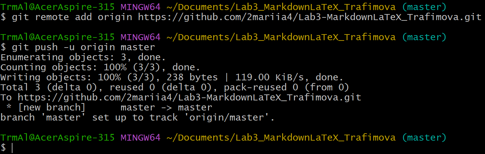

# Лабораторная работа №3: Markdown и LaTeX

В данной лабораторной работе изучаются основы работы с Markdown-разметкой и базовое использование LaTeX в документации проекта. Рассматриваются заголовки, списки, таблицы, ссылки, изображения, блоки кода, цитаты, а также математические формулы.

## Содержание

- [Структура проекта](#структура-проекта)
- [Markdown-элементы](#markdown-элементы)
- [Таблица](#таблица)
- [Изображение](#изображение)
- [Ссылка](#ссылка)
- [Чекбоксары](#чебоксары)
- [Сноска](#сноска)
- [Alert-блоки](#alert-блоки-github)
- [LaTeX](#inline-latex)

---

## Структура проекта

- `docs/` — Markdown-файлы с примерами
  - `headersLab3_Leontev.md` — заголовки
  - `separatorsLab3_Leontev.md` — горизонтальные линии
  - `formattingLab3_Leontev.md` — форматирование текста
  - `listsLab3_Leontev.md` — списки
  - `linksImagesLab3_Leontev.md` — ссылки и изображения
  - `codeQuotesLab3_Leontev.md` — блоки кода и цитаты
  - `tablesLab3_Leontev.md` — таблицы
  - `advancedMarkdownLab3_Leontev.md` — дополнительные возможности
  - `latexLab3_Leontev.md` — LaTeX-формулы
- `img/` — скриншоты
- `latex/` — примеры формул
- `README.md` — этот файл

---

## Markdown-элементы

### Заголовки

# Первый уровень
## Второй уровень
### Третий уровень
#### четвёртый уровень

### Горизонтальная линия

---
***
___

### Форматирование текста

**Полужирный**, *курсив*, ~~зачёркнутый~~, `моноширный`

### Списки

- Маркированный
- Нумерованный
  1. Первый
  2. Второй
- Вложенный
  - Подпункт

### Цитата

> Это цитата в Markdown.

### Блок кода

```csharp
Console.WriteLine("Hello, Markdown!");
```
### Таблица

|Название|Страна|Площадь|Глубина|
|:-------|:-----|:-----:|:-----:|
|Байкал|Россия|31500|1620|
|Мичиган|США|57441|281|

### Изображение



### Ссылка

[GitHub](https://github.com "Перейти на GitHub")

### Чебоксары
 - [x] Task 1
 - [ ] Task 2

### Сноска

Текст[^markdown].
[^markdown]: Примечание

### Alert-блоки GitHub

> [!NOTE]
> Это заметка.

> [!TIP]
> Это совет.

> [!WARNING]
> Это предупреждение.

### Inline LaTeX

Площадь круга: $S = \pi r^2$

### Block LaTeX

$$
\sum_{i=1}^n i = \frac{n(n+1)}{2}
$$
